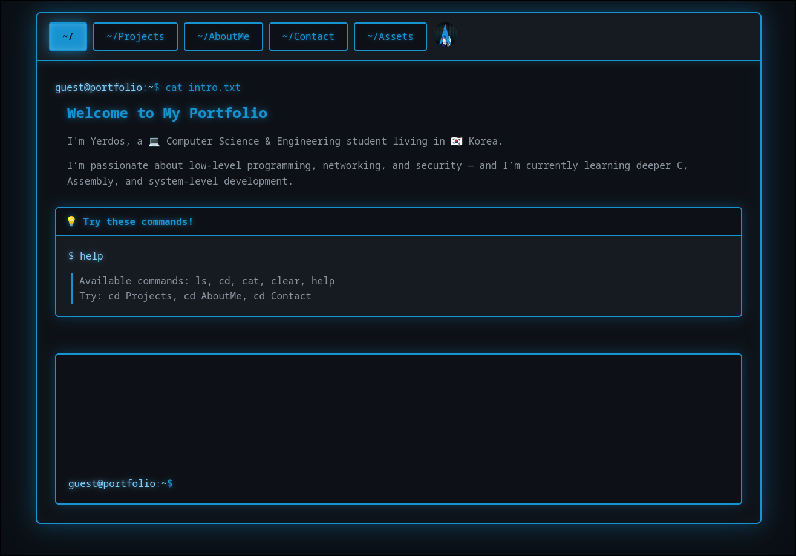
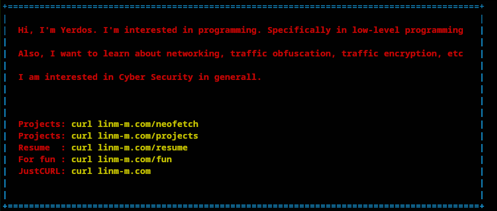

# Profile page (`curl`able)

- ## Intro:
    - #### [Explanation](#basic-explanation)
    - #### [Requirements](#requirements-1)
    - #### [Structure](#structure-1)
    - #### [One-liner](#one-line-installation)
    - #### [Manual installation](#manual-installation-1)
    - #### [cURL support](#curl-support-1)
    - #### [Firewall](#firewall-1)

---
- ## Basic explanation:
    - #### Simple profile page for recruiters.
    

    - ##### You can also `curl example.com`
    

---
- ## Requirements:
    - #### Caddy:
        For reverse proxy.
    - #### curl:
        It's all about `curl`ability.
    - #### npm, node:
        To install dependencies. `npm install`
    - #### git:
        To `git clone`
    - #### ufw:
        To manage firewall `sudo ufw allow 80 && sudo ufw allow 443`
    - #### systemctl:
        To start daemons `systemctl daemon-reload`

---
- ## Structure:
    - #### `public` directory:
        Contains all of the necessary files for browser.
    - #### `assets` directory:
        Contains files that are accessible without authentication.
    - #### `protected-assets` directory:
        Contains files that are accessible only after authentication.\
        Place your files that only people with password can view.
    - #### `server.js` file:
        Server, responsible for authentication and detecting `curl` requests.
    - #### `profile.server` file:
        Meant to stay in `/etc/systemd/system/`.

---
- ## One line installation
    ```bash
    bash <(curl -Ls https://raw.githubusercontent.com/YerdosNar/Profile/master/install.sh)
    ```
    >Required commands should be installed manually though.\
    >Change contact information in `public/script.js`

---
- ## Manual installation
    - #### Clone to profile directory
        ```bash
        sudo mkdir -p /var/www/profile
        sudo git clone https://github.com/YerdosNar/Profile.git /var/www/profile
        ```
    - #### Change owner to `www-data`
        >Usually `www-data` user exists by default.\
        >Check with `id www-data`\
        >If it doesn't exist, run `sudo useradd -r -s /usr/sbin/nologin www-data`
        ```bash
        sudo chown -R www-data:www-data /var/www/profile
        ```
    - #### Install dependencies as `www-data`
        ```bash
        cd /var/www/profile
        sudo -u www-data npm install
        ```
    - #### Copy `profile.service`
        ```bash
        sudo cp /var/www/profile/profile.service /etc/systemd/system/
        ```
    - #### Reload `daemon-reload` and start
        ```bash
        sudo systemctl daemon-reload
        sudo systemctl enable profile
        sudo systemctl start profile
        ```
    - #### Check status
        ```bash
        sudo systemctl status profile
        ```

    - #### Content of `profile.service`
        ```service
        [Unit]
        Description=Profile Portfolio Website
        After=network.target

        [Service]
        Type=simple
        User=www-data
        Group=www-data
        WorkingDirectory=/var/www/profile
        ExecStart=/usr/bin/node server.js
        Restart=on-failure
        RestartSec=10
        StandardOutput=syslog
        StandardError=syslog
        SyslogIdentifier=profile
        Environment=NODE_ENV=production
        Environment=PORT=3000

        [Install]
        WantedBy=multi-user.target
        ```

    - #### Change `public/script.js`
        Navigate to `~/Contact` and change to your own name.
        Navigate to `~/Projects` and change to your own projects.

---
- ## `curl` support
    - #### `curl` without `https://`
        - ##### Caddyfile content
            >To run `curl example.com` without writing `https://` I recommend two domain names (because I am inexperienced, and I don't know other ways)

            ```Caddyfile
            example.com:80 { # This domain name for `curl`ing
                root * /var/www/profile/public # or your own
                @terminal {
                    header User-Agent *curl*
                    header User-Agent *wget*
                    header User-Agent *fetch*
                }

                handle @terminal {
                    header Content-Type "text/plain; charset=utf-8"

                    rewrite /projects projects.txt
                    rewrite /resume resume.txt
                    rewrite /fun fun.txt

                    rewrite / index.txt

                    file_server
                }

                handle {
                    header Content-Type "text/plain"
                    response "Terminal only. Use `curl example.com` or visit `secure.example.com`" 403
                }
            }

            secure.example.com:443 { # This domain name for browsing
                reverse_proxy localhost:3000
            }
            ```
            Try
            ```bash
            curl example.com
            ```
    - #### `curl` with `https://`
        - ##### Caddyfile content:
            ```Caddyfile
            example.com {
                reverse_proxy localhost:3000
            }
            ```
            Try
            ```
            curl https://example.com
            ```

---
- ## Firewall
    ```bash
    sudo ufw allow 80
    sudo ufw allow 443
    sudo ufw enable
    ```
